<div align="center">

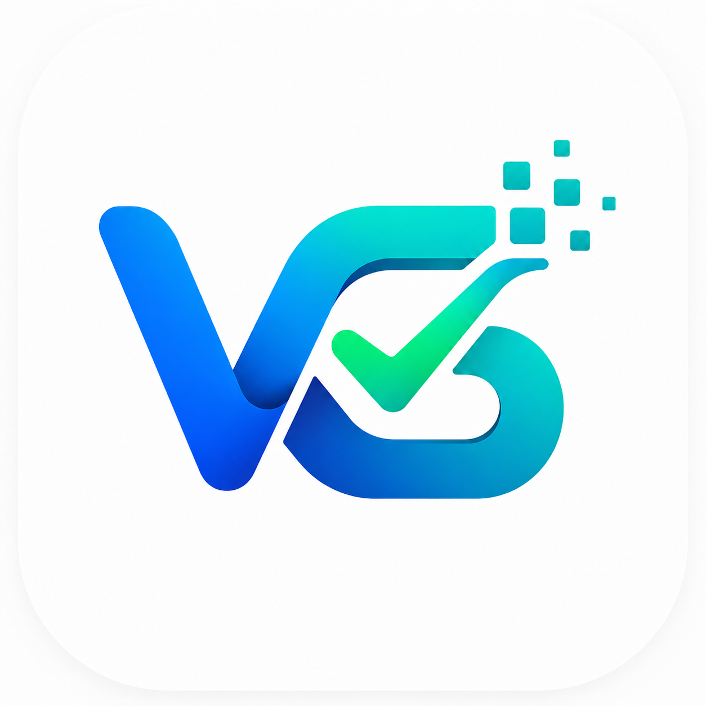

# 🚀 WorkSync AI
### **The Intelligent Workspace for High-Performance Teams**

WorkSync AI is a production-grade project management ecosystem engineered with **Flutter**, **Firebase**, and **Clean Architecture**. It combines modern UI/UX with AI-driven intelligence to streamline team collaboration.

<br />

[](https://flutter.dev)
[](https://dart.dev)
[](https://firebase.google.com)
[](https://blog.cleancoder.com/uncle-bob/2012/08/13/the-clean-architecture.html)
[](https://opensource.org/licenses/MIT)

<br />

[Explore Documentation](#-project-overview) • [View Screenshots](#-visual-showcase) • [Setup Guide](#-installation-guide)

</div>

---

## 📖 Project Overview

In today's fast-paced environment, static task lists are no longer enough. **WorkSync AI** was developed to bridge the gap between simple task trackers and complex enterprise tools. 

By leveraging **AI to analyze real workspace data** and providing a robust, **real-time collaboration system**, WorkSync AI empowers users to focus on high-impact work. Whether you are an individual freelancer or a scaling team, WorkSync AI provides the clarity and synchronization needed to achieve peak productivity.

---

## ✨ Features

- **🤖 Context-Aware AI**: A dedicated assistant that understands your projects and tasks, providing efficiency scores and workload analysis.
- **🤝 Project Invitations**: A formal, secure invitation system with real-time notifications for seamless team onboarding.
- **⚡ Zero-Latency UX**: High-performance data fetching with **Shimmer skeleton screens** for an instantaneous, premium feel.
- **📊 Smart Dashboard**: Real-time statistics and AI-driven workspace insights updated instantly via Firestore.
- **📅 Interactive Calendar**: Manage your schedule with a native date navigation system and daily task visualization.
- **🔐 Enterprise-Grade Security**: Industry-standard authentication via Google and encrypted Email/Password protocols.
- **🎨 Modern Design System**: A clean, Material 3 based interface with custom iconography and professional color themes.

---

## 🛠️ Tech Stack

| Category | Tools | Description |
| :--- | :--- | :--- |
| **Frontend** | **Flutter** | Cross-platform UI framework |
| **Language** | **Dart** | High-performance client-optimized language |
| **Backend** | **Firebase** | Real-time database (Firestore) & Authentication |
| **State Mgt** | **Riverpod** | Reactive, compile-safe state management |
| **Navigation** | **GoRouter** | Declarative routing system |
| **Local Cache** | **Firestore Persistence** | Seamless offline data access |
| **Architecture** | **Clean Architecture** | Decoupled, testable, and scalable design |

---

## 🏗️ Clean Architecture

The project is structured following the **Clean Architecture** pattern to ensure maximum scalability:

- **Domain Layer**: Contains Entities, Repository Interfaces, and Usecases.
- **Data Layer**: Implementation of repositories, Firestore DTOs (Models), and data sources.
- **Presentation Layer**: Riverpod Notifiers (ViewModels) and UI Widgets.

---

## 📂 Folder Structure

```text
lib/
├── core/
│   ├── constants/       # Global Enums & stable strings
│   ├── providers/       # Centralized Riverpod definitions
│   ├── routes/          # GoRouter configuration
│   └── theme/           # Material 3 Theme & App Colors
├── data/
│   ├── models/          # Firestore DTOs with (de)serialization
│   └── repositories/    # Concrete repo implementations
├── domain/
│   ├── entities/        # Pure business objects
│   ├── repositories/    # Abstract repo definitions
│   └── usecases/        # Isolated business logic units
├── screens/             # Modular UI (AI, Auth, Dashboard, etc.)
├── services/            # Low-level Firebase & AI Logic
└── widgets/             # Reusable UI & Shimmer indicators
```

---

## 📱 Visual Showcase (The User Journey)

### 🚀 1. App Launch
<div align="center">
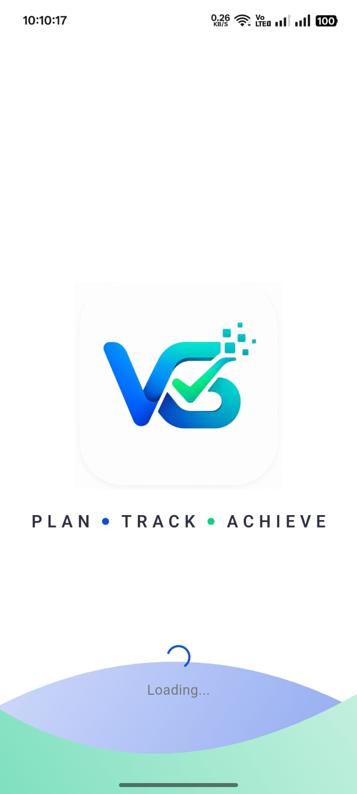
</div>

### 👋 2. Onboarding
<div align="center">
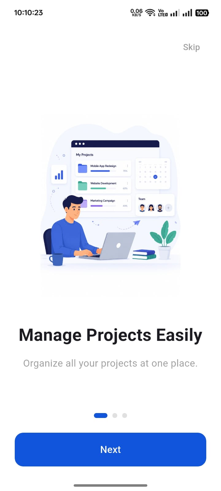
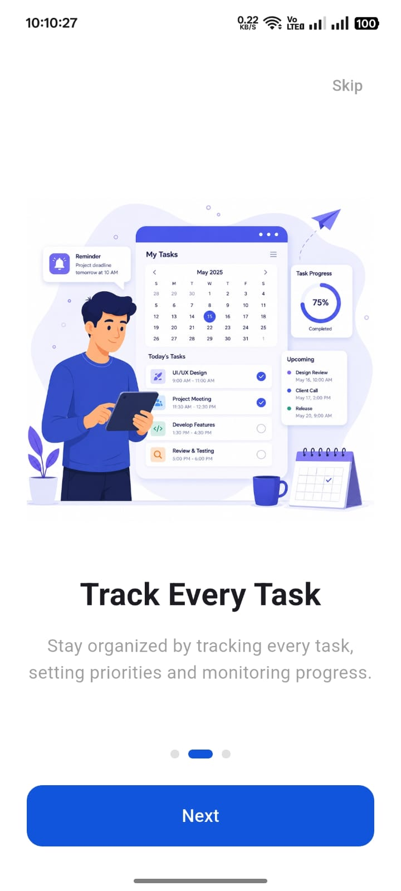
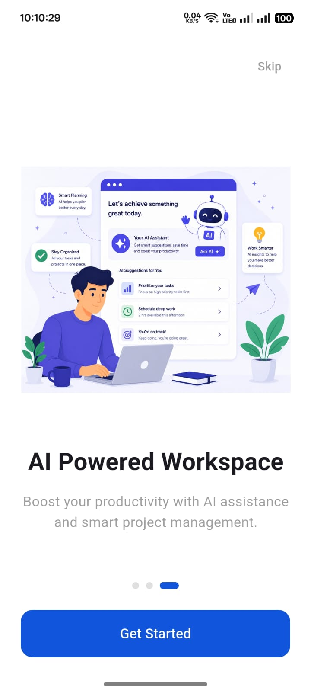
</div>

### 🔐 3. Authentication
<div align="center">
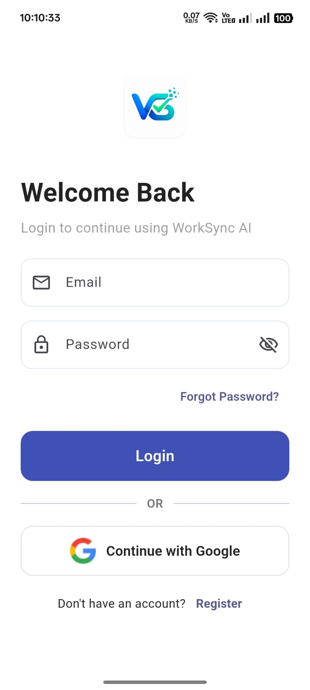
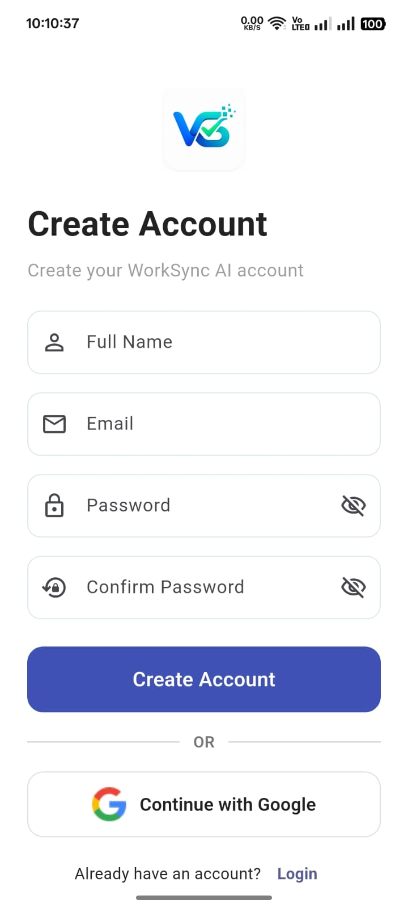
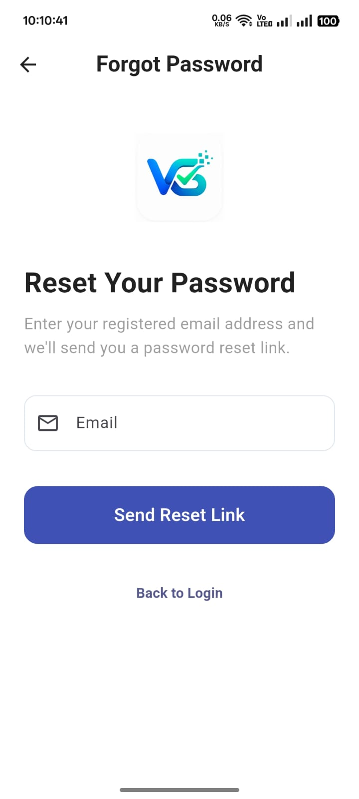
</div>

### 🏠 4. Dashboard
<div align="center">
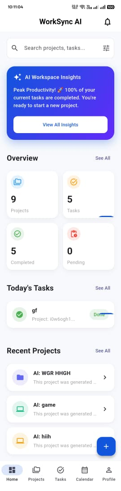
</div>

### 📁 5. Project Management
<div align="center">
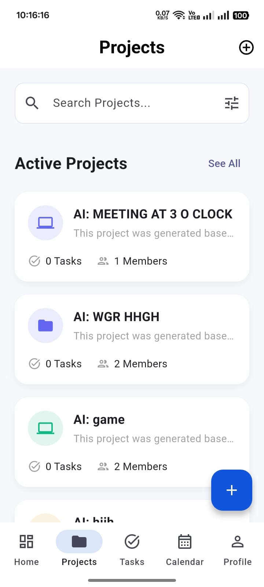
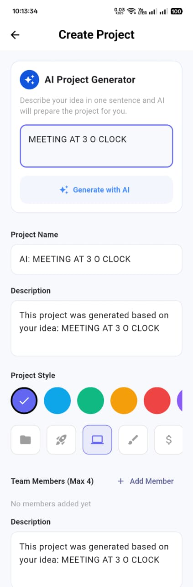
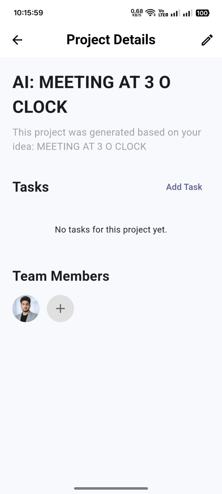
</div>

### 👥 6. Team Collaboration
<div align="center">
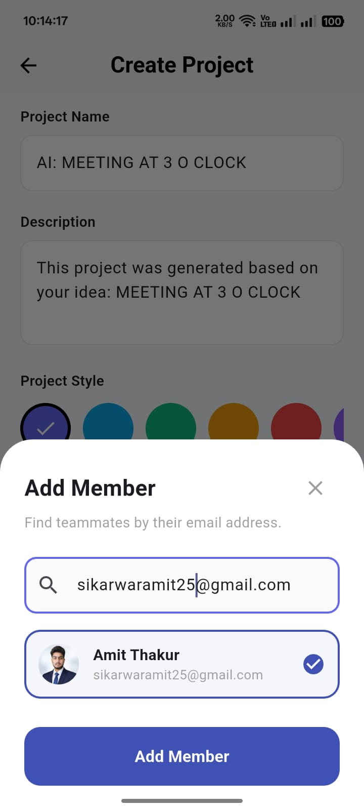
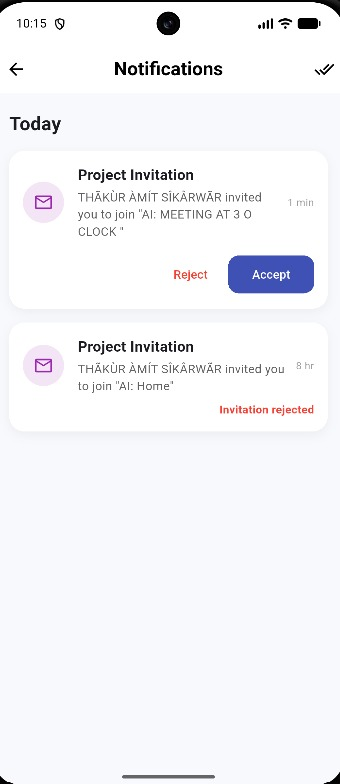
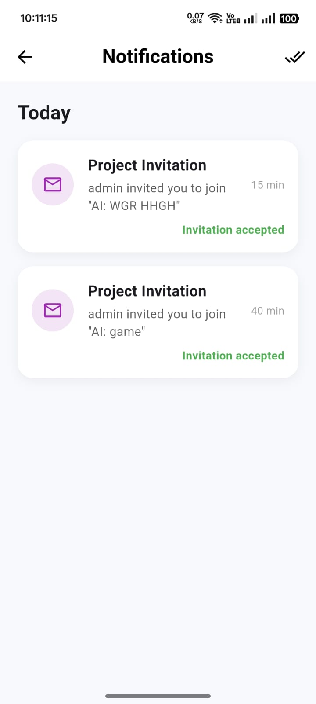
</div>

### ✅ 7. Task Management
<div align="center">
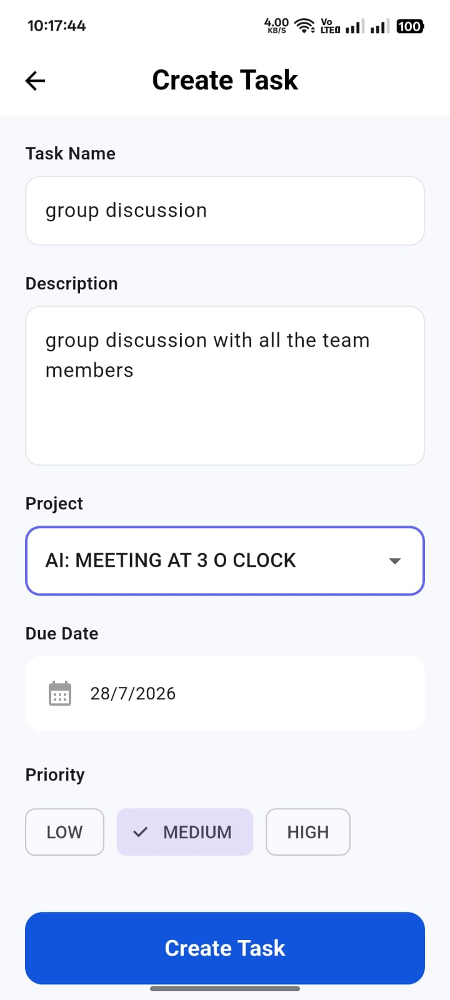
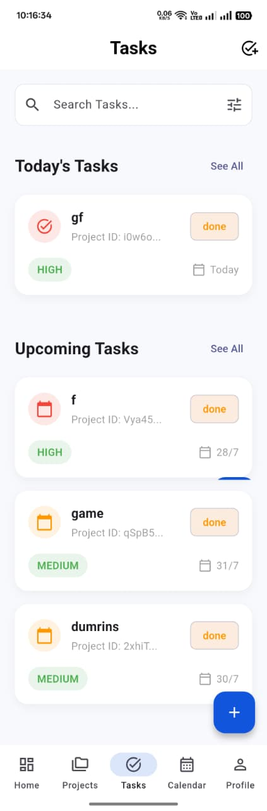
</div>

### 📅 8. Calendar
<div align="center">
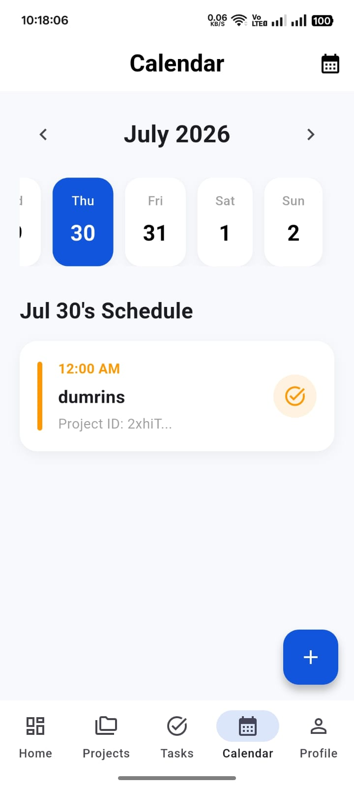
</div>

### 🤖 9. AI Assistant
<div align="center">

</div>

### 👤 10. Profile
<div align="center">
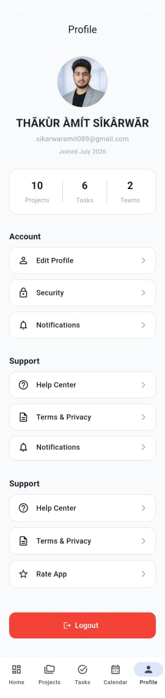
</div>

---

## 🚀 Installation Guide

1. **Clone the Repository**
   ```bash
   git clone https://github.com/amittthakur2156/WorkSync-AI.git
   cd WorkSync-AI
   ```
2. **Install Dependencies**
   ```bash
   flutter pub get
   ```
3. **Run the App**
   ```bash
   flutter run
   ```

---

## 🔥 Firebase Setup

1. Enable **Authentication** (Google & Email/Password).
2. Enable **Cloud Firestore** and apply the rules located in the `.artifacts` directory.
3. Place your `google-services.json` in `android/app/`.

---

## 📈 Roadmap

- [ ] **Push Notifications**: Real-time alerts for invitations.
- [ ] **Dark Mode**: Fully adaptive theme support.
- [ ] **Multi-Organization**: Support for isolated company workspaces.

---

## 🤝 Contributing

Contributions are welcome!
1. Fork the Project.
2. Create your Feature Branch (`git checkout -b feature/AmazingFeature`).
3. Commit your Changes (`git commit -m 'Add some AmazingFeature'`).
4. Push to the Branch (`git push origin feature/AmazingFeature`).
5. Open a Pull Request.

---

## 👨–💻 Developer Section

**Amit Kumar**  
*Full-Stack Flutter Developer*

- GitHub: [@amittthakur2156](https://github.com/amittthakur2156)
- Portfolio: [amittthakur2156.github.io](https://github.com/amittthakur2156)

---

## ⭐ Support
If you find this project helpful, please give it a **Star** on GitHub!

---

## 📄 License
Distributed under the **MIT License**. See `LICENSE` for more information.

<div align="center">
<br />
Built with ❤️ for the Global Flutter Community.
</div>
